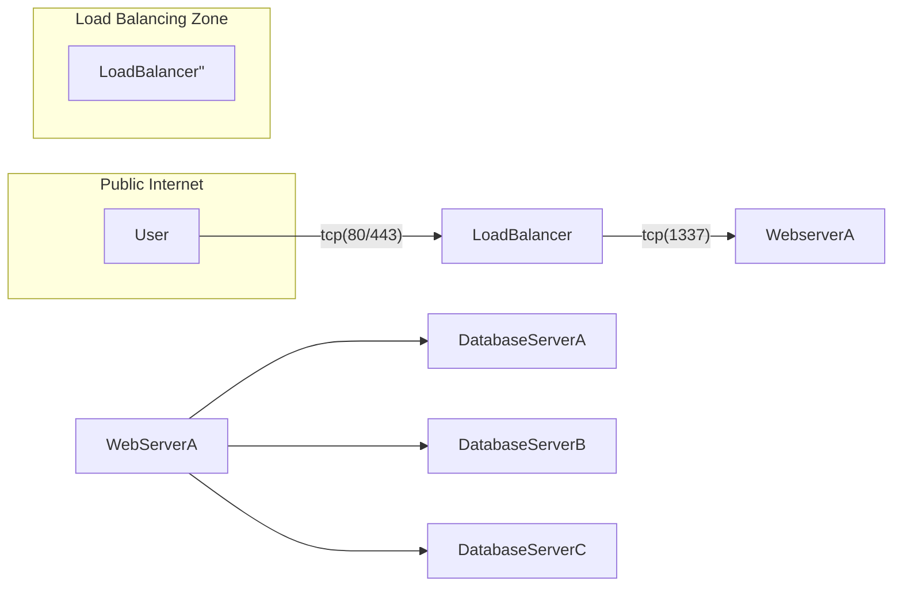

```mermaid
    flowchart LR
        subgraph Public Internet
            User
        end

        subgraph Load Balancing Zone
            LoadBalancer"
        end

        User --tcp(80/443) --> LoadBalancer

        LoadBalancer --tcp(1337) --> WebserverA

        WebServerA --> DatabaseServerA
        WebServerA --> DatabaseServerB
        WebServerA --> DatabaseServerC


```